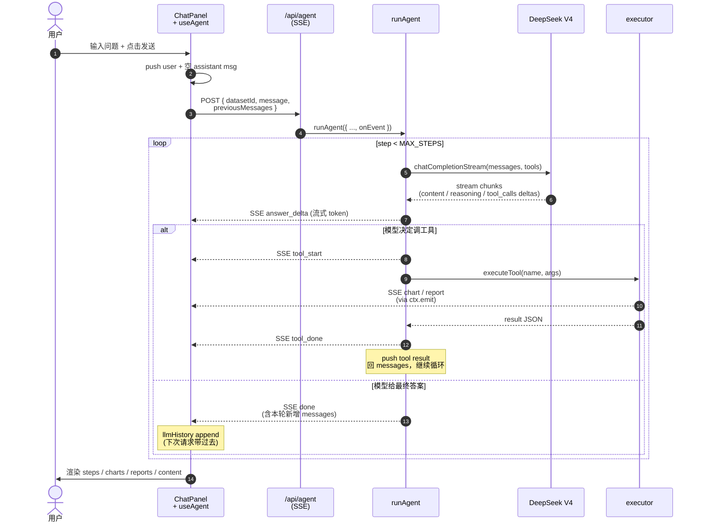
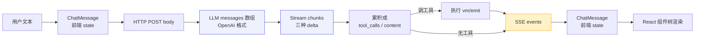

# LEARNING.md — 项目学习笔记

> 这是一份给你自己的学习与面试准备文档。重点不在「项目做了什么」（看 PROGRESS.md），而在「**为什么这样做**」和「**怎么讲清楚**」。
>
> 阅读路径：
>
> - **第一次复习**：1 → 2 → 8（一小时建立全局认知）
> - **面试前一晚**：3 → 4 → 6（重读关键决策 + 亮点 + 问题预演）
> - **深入研究**：5 → 7（踩坑细节 + 演进方向）

---

## 1. 项目 30 秒讲清楚

> **一句话**：让非技术用户上传 CSV/Excel，用自然语言提问，AI Agent 自动调用工具多步推理（看数据 → 计算 → 画图 → 给结论），全过程在界面上实时展示。

**解决了什么问题？** 数据分析门槛高：要懂 SQL/Python、要会画图、要写报告。运营/产品/老板这些非技术角色想看数字就得排队等数据组。本项目把这个流程 AI 化，每个步骤可视。

**目标用户 / 场景**：

- 业务侧的运营、产品、销售
- 把 Excel 报表丢进去问"哪个区域销售最高"、"用户留存趋势怎样"
- 求职作品集 / 公司 AI 转型 POC

**技术栈一览**：

| 层 | 选型 | 为什么 |
|---|---|---|
| 框架 | Next.js 16 (App Router) | 全栈一体，API Route 不用单独搭后端 |
| 语言 | TypeScript strict | 大量类型流转（SSE event / tool args / LLM message），不用 TS 维护成本高 |
| LLM | DeepSeek V4 (OpenAI 兼容) | 价格低、中文好、支持 thinking mode；OpenAI 兼容意味着切 provider 零业务改动 |
| 流式 | SSE | 单向流（服务端推客户端）、HTTP 同源、断线浏览器自动重连。WebSocket 是双向通信用的，本场景过度设计 |
| 图表 | Recharts | React 原生组件、SVG 输出（可抓取嵌入报告）、跟主题 token 兼容 |
| 解析 | papaparse + xlsx | 服务端解析，避免大文件占用客户端内存 |
| 沙箱 | node:vm | Phase 1 满足；E2B 是 Phase 3 的演进 |
| 状态 | React useState + useRef | 没引 Redux/Zustand —— 状态局部、流转简单 |
| 样式 | Tailwind v4 + CSS variables | v4 把配置移到 CSS（`@theme inline`），token 系统天然 |

---

## 2. 完整数据流：一轮对话发生了什么

> 这是面试最爱问的"画一下你的系统架构"。背下这条链路。
>
> 下面两张图：**时序图**讲"消息怎么在角色间流动"（动态视角），**流程图**讲"数据形态如何变化"（静态视角）。两个角度都要能讲。

### 2.1 时序图：消息流转



**关键看点**：

- `-->>` 是异步推送（SSE），`->>` 是同步调用
- **loop 块**对应 `for (step < MAX_STEPS)`，alt/else 对应"有/无 tool_calls"分支
- 工具执行时 chart/report 由 `ctx.emit` 直接推给前端，不走 result——所以图里有两条 Tool→FE 的箭头

### 2.2 流程图：数据形态变化



**关键看点**：

- 紫色块是 **LLM 协议层**（OpenAI 兼容格式），不能改，所有 provider 共用
- 黄色块是 **SSE 协议层**（我们自定义的事件 union），前后端契约
- 同一份"对话状态"出现两次（B 和 I）：B 是上行发出去的、I 是下行收回来的——**后端 stateless**，这是项目核心设计之一

### 2.3 关键文件索引

- `app/api/agent/route.ts` — SSE 入口
- `lib/agent.ts` — Agent 主循环（最重要的文件）
- `lib/tools/executor.ts` — 工具执行
- `hooks/use-agent.ts` — 前端 SSE 消费 + 多轮历史
- `components/chat/ChatPanel.tsx` — 滚动 + 输入

### 2.4 附录：一次完整请求的数据流追踪

> 用一个真实场景（用户问"哪个区域销售额最高？"）追踪每一步的真实数据形态。
> 面试时如果对方追问"具体讲讲消息怎么传"，这就是逐步展开的金牌素材。

**准备：数据集已上传到内存**

```ts
// lib/dataset-store.ts 的内存存储
{
  id: 'ds_abc123',
  name: 'sales.csv',
  columns: [
    { name: 'region', type: 'string', nullCount: 0 },
    { name: 'product', type: 'string', nullCount: 0 },
    { name: 'quantity', type: 'number', nullCount: 0 },
    { name: 'price', type: 'number', nullCount: 0 },
  ],
  rows: [
    { region: '华东', product: 'A001', quantity: 10, price: 3000 },
    { region: '华东', product: 'A002', quantity: 5, price: 2200 },
    { region: '华北', product: 'A001', quantity: 8, price: 3000 },
    // ... 共 100 行
  ],
}
```

**① 用户输入 → 前端组装请求**（`hooks/use-agent.ts:send`）

用户按发送，前端先 push 两条到 React state：

```ts
messages = [
  { id: 'u-1', role: 'user', content: '哪个区域销售额最高？' },
  { id: 'a-1', role: 'assistant', steps: [], charts: [], reports: [], content: '' },
]
```

然后 fetch：

```http
POST /api/agent HTTP/1.1
Content-Type: application/json

{
  "datasetId": "ds_abc123",
  "message": "哪个区域销售额最高？",
  "previousMessages": []
}
```

注意 `previousMessages: []`——第一次提问 `llmHistoryRef.current` 是空数组。第二轮起会带上一轮的完整历史。

**② API Route → runAgent**（`app/api/agent/route.ts`）

API Route 创建 SSE 流，把 `onEvent` 接到 stream writer：

```ts
const stream = new ReadableStream({
  start(controller) {
    runAgent({
      datasetId: 'ds_abc123',
      userMessage: '哪个区域销售额最高？',
      previousMessages: [],
      onEvent: (event) => {
        const line = `data: ${JSON.stringify(event)}\n\n`
        controller.enqueue(new TextEncoder().encode(line))
      },
    }).finally(() => controller.close())
  }
})
```

**③ runAgent 构造 messages**（`lib/agent.ts:62-71`）

```ts
const messages = [
  {
    role: 'system',
    content: '你是一个数据分析 Agent...\n\n当前数据集 ID：ds_abc123（调用工具时必须传入此 ID 作为 dataset_id 参数）'
  },
  { role: 'user', content: '哪个区域销售额最高？' }
]

const baseLength = 1  // 让本轮新增从 user 切起
```

**④ 第一次发给 DeepSeek**

这是项目里最大的一次数据流转——把 messages 加 tools schema 一起发给 LLM：

```http
POST https://api.deepseek.com/v1/chat/completions
Authorization: Bearer sk-xxx

{
  "model": "deepseek-v4-flash",
  "stream": true,
  "messages": [
    { "role": "system", "content": "你是一个数据分析 Agent..." },
    { "role": "user", "content": "哪个区域销售额最高？" }
  ],
  "tools": [
    {
      "type": "function",
      "function": {
        "name": "inspect_data",
        "description": "查看数据集的结构信息...",
        "parameters": {
          "type": "object",
          "properties": {
            "dataset_id": { "type": "string", "description": "..." }
          },
          "required": ["dataset_id"]
        }
      }
    },
    { "type": "function", "function": { "name": "run_analysis", ... } },
    { "type": "function", "function": { "name": "create_chart", ... } },
    { "type": "function", "function": { "name": "generate_report", ... } }
  ]
}
```

模型看到 4 个工具描述 + 用户问题，**决定第一步先调 `inspect_data` 了解数据结构**。

**⑤ DeepSeek 流式响应 chunks**

收到的不是一次完整 JSON，而是一连串 SSE chunks：

```
data: {"choices":[{"delta":{"role":"assistant","reasoning_content":"用户想"}}]}

data: {"choices":[{"delta":{"reasoning_content":"知道哪个区域销售额最高"}}]}

data: {"choices":[{"delta":{"tool_calls":[{"index":0,"id":"call_abc","type":"function","function":{"name":"inspect_data"}}]}}]}

data: {"choices":[{"delta":{"tool_calls":[{"index":0,"function":{"arguments":"{\"dat"}}]}}]}

data: {"choices":[{"delta":{"tool_calls":[{"index":0,"function":{"arguments":"aset_id\":\"ds_abc"}}]}}]}

data: {"choices":[{"delta":{"tool_calls":[{"index":0,"function":{"arguments":"123\"}"}}]}}]}

data: {"choices":[{"finish_reason":"tool_calls","delta":{}}]}

data: [DONE]
```

注意每条都是 incremental 片段——`arguments` 字符串被切成多段流回来。

**⑥ runAgent 累积 chunks**（`lib/agent.ts:86-124`）

```ts
contentBuffer = ''
reasoningBuffer = '用户想知道哪个区域销售额最高，我应该先看下数据结构...'
toolCallAccs = Map {
  0 => {
    id: 'call_abc',
    name: 'inspect_data',
    args: '{"dataset_id":"ds_abc123"}'  // 三段拼接而成
  }
}
```

把 assistant reply 回填到 messages：

```ts
messages.push({
  role: 'assistant',
  content: '',
  tool_calls: [{
    id: 'call_abc',
    type: 'function',
    function: { name: 'inspect_data', arguments: '{"dataset_id":"ds_abc123"}' }
  }],
  reasoning_content: '用户想知道...'  // ← V4 thinking mode 必须 echo
})
```

此时 messages 变成 **3 条**：system + user + assistant(tool_calls)

**⑦ 执行工具 + 推 SSE 给前端**

```ts
onEvent({ type: 'tool_start', tool: 'inspect_data', description: '正在读取数据结构...' })
const result = await executeTool('inspect_data', { dataset_id: 'ds_abc123' }, ctx)
onEvent({ type: 'tool_done', tool: 'inspect_data' })
```

`executeTool` 内部执行 `getDatasetSummary`：

```ts
{
  dataset_id: 'ds_abc123',
  name: 'sales.csv',
  columns: [
    { name: 'region', type: 'string', nullCount: 0 },
    { name: 'product', type: 'string', nullCount: 0 },
    { name: 'quantity', type: 'number', nullCount: 0 },
    { name: 'price', type: 'number', nullCount: 0 },
  ],
  rowCount: 100,
  sampleRows: [
    { region: '华东', product: 'A001', quantity: 10, price: 3000 },
    { region: '华东', product: 'A002', quantity: 5, price: 2200 },
    { region: '华北', product: 'A001', quantity: 8, price: 3000 }
  ]
}
```

`JSON.stringify` 后回填到 messages：

```ts
messages.push({
  role: 'tool',
  tool_call_id: 'call_abc',  // 必须匹配上一条 assistant.tool_calls[0].id
  content: '{"dataset_id":"ds_abc123","name":"sales.csv","columns":[...],"rowCount":100,"sampleRows":[...]}'
})
```

此时 messages 变成 **4 条**：system + user + assistant + tool

**⑧ 第二次发给 DeepSeek**

整个 messages 数组重新发一遍（OpenAI 协议 stateless，每次必须带完整上下文）：

```http
POST https://api.deepseek.com/v1/chat/completions

{
  "model": "deepseek-v4-flash",
  "stream": true,
  "tools": [...],
  "messages": [
    { "role": "system", "content": "..." },
    { "role": "user", "content": "哪个区域销售额最高？" },
    {
      "role": "assistant",
      "content": "",
      "tool_calls": [{ "id": "call_abc", "type": "function", "function": { "name": "inspect_data", "arguments": "..." } }],
      "reasoning_content": "用户想知道..."
    },
    {
      "role": "tool",
      "tool_call_id": "call_abc",
      "content": "{\"name\":\"sales.csv\",\"columns\":[...],\"rowCount\":100,\"sampleRows\":[...]}"
    }
  ]
}
```

模型看到列结构（region/quantity/price），**决定调 `run_analysis`**：

```
data: ...delta: { tool_calls: [{ index: 0, id: 'call_def', function: { name: 'run_analysis', arguments: '{"dataset_id":"ds_abc123","intent":"按 region 列分组并对 quantity*price 求和...","description":"正在按区域汇总销售额..."}' } }] }
```

**⑨ run_analysis 特殊：内部又调一次 LLM 生成 JS**（`lib/tools/executor.ts:execAnalysis`）

这是项目独特的设计——`run_analysis` 工具内部还要再调 LLM 一次生成 JS 代码：

```ts
async function execAnalysis({ dataset_id, intent, description }) {
  const ds = getDataset(dataset_id)
  // 二次 LLM 调用：根据 intent 生成 JS 代码
  const code = await generateAnalysisCode(ds.columns, ds.rows.slice(0, 2), intent)
  // 在 vm 沙箱执行
  const result = runInSandbox(code, ds.rows)
  return { description, data: result }
}
```

`generateAnalysisCode` 发出**另一次完整 HTTP 请求**（与第 ④ 步不同）：

```http
POST https://api.deepseek.com/v1/chat/completions

{
  "model": "deepseek-v4-flash",
  "temperature": 0.2,
  "messages": [
    {
      "role": "system",
      "content": "你是数据分析代码生成器。根据用户的自然语言意图，生成一段 JavaScript 代码..."
    },
    {
      "role": "user",
      "content": "列：region(string), product(string), quantity(number), price(number)\n样本（前 2 行）：[{...},{...}]\n意图：按 region 列分组并对 quantity*price 求和"
    }
  ]
}
```

DeepSeek 返回（非流式，一次给完）：

```js
const grouped = rows.reduce((acc, r) => {
  const k = r.region
  acc[k] = (acc[k] ?? 0) + Number(r.quantity ?? 0) * Number(r.price ?? 0)
  return acc
}, {})
return Object.entries(grouped)
  .map(([region, total]) => ({ region, total }))
  .sort((a, b) => b.total - a.total)
```

`vm.runInContext` 在沙箱里执行，返回：

```ts
[
  { region: '华东', total: 44700 },
  { region: '华北', total: 31500 },
  { region: '华南', total: 25800 }
]
```

最终 `run_analysis` 的 tool result（string）：

```json
{"description":"正在按区域汇总销售额...","data":[{"region":"华东","total":44700},{"region":"华北","total":31500},{"region":"华南","total":25800}]}
```

回填到 messages。此时 messages **6 条**：system + user + assistant + tool + assistant + tool

**⑩ 第三次发给 DeepSeek，模型给最终答案**

messages 带着用户问题 + inspect 结果 + run_analysis 算出来的数据。模型这次返回**流式 content，无 tool_calls**：

```
data: ...delta: { content: "华东" }
data: ...delta: { content: "区域销售额最高，" }
data: ...delta: { content: "达 **44," }
data: ...delta: { content: "700**" }
data: ...delta: { content: " 元，比第二名华北" }
data: ...delta: { content: "（31,500）高出 42%。" }
...
data: ...finish_reason: "stop"
```

每个 content delta 都立刻 emit `answer_delta` 给前端：

```ts
onEvent({ type: 'answer_delta', text: '华东' })
onEvent({ type: 'answer_delta', text: '区域销售额最高，' })
// ...
```

前端 useAgent 收到后 `content += text`，React rerender，**用户看到打字机效果**。

模型没调工具，runAgent 判定终止：

```ts
onEvent({
  type: 'done',
  messages: messages.slice(1)  // 切掉 system，留下本轮新增 6 条
})
```

**⑪ 前端 SSE 消费**（`hooks/use-agent.ts:consumeSSE`）

整个对话期间前端按顺序收到这些事件：

```
data: {"type":"tool_start","tool":"inspect_data","description":"正在读取数据结构..."}
data: {"type":"tool_done","tool":"inspect_data"}
data: {"type":"tool_start","tool":"run_analysis","description":"正在按区域汇总销售额..."}
data: {"type":"tool_done","tool":"run_analysis"}
data: {"type":"answer_delta","text":"华东"}
data: {"type":"answer_delta","text":"区域销售额最高，"}
... (N 个 answer_delta)
data: {"type":"done","messages":[...]}
```

每个事件按 `\n\n` 分隔，前端逐个 parse + handleEvent。

**⑫ 前端 React state 最终态**

```ts
messages = [
  { id: 'u-1', role: 'user', content: '哪个区域销售额最高？' },
  {
    id: 'a-1',
    role: 'assistant',
    steps: [
      { tool: 'inspect_data', description: '正在读取数据结构...', status: 'done' },
      { tool: 'run_analysis', description: '正在按区域汇总销售额...', status: 'done' }
    ],
    charts: [],
    reports: [],
    content: '华东区域销售额最高，达 **44,700** 元，比第二名华北（31,500）高出 42%。'
  }
]

// llmHistoryRef.current 也更新了：
[
  { role: 'user', content: '哪个区域销售额最高？' },
  { role: 'assistant', content: '', tool_calls: [...], reasoning_content: '...' },
  { role: 'tool', tool_call_id: 'call_abc', content: '{...}' },
  { role: 'assistant', content: '', tool_calls: [...], reasoning_content: '...' },
  { role: 'tool', tool_call_id: 'call_def', content: '{...}' },
  { role: 'assistant', content: '华东区域销售额最高...', reasoning_content: '...' }
]
```

下次用户再问问题，这 6 条作为 `previousMessages` 发回后端，构成多轮上下文。

**数据形态变换全景**

```
"哪个区域销售额最高？" (string)
    ↓ 前端 push 到 ChatMessage[]
{ role: 'user', content: '...' } (ChatMessage)
    ↓ HTTP POST body
{ datasetId, message, previousMessages: [] } (API 入参)
    ↓ runAgent 构造
[system, user] (LLM messages[])
    ↓ + tools 一起发给 DeepSeek
HTTP POST → DeepSeek
    ↓ 流式 chunks 回来
{ tool_calls: [{ index: 0, id, name, arguments }] } (三种 delta)
    ↓ 累积成完整 ToolCall
{ id: 'call_abc', function: { name, arguments: JSON string } }
    ↓ executor 解析 args
{ dataset_id: 'ds_abc123' } (JS object)
    ↓ 执行工具，返回结果
{ dataset_id, name, columns, ... } (JS object)
    ↓ JSON.stringify 后回填
{ role: 'tool', tool_call_id, content: '<JSON string>' } (LLM messages[])
    ↓ 继续循环直到模型给出 content
{ role: 'assistant', content: '华东...' }
    ↓ content delta 每段实时 emit
{ type: 'answer_delta', text: '华东' } (SSE event)
    ↓ SSE encode
"data: {...}\n\n" (UTF-8 bytes 流)
    ↓ 前端 TextDecoder + parse
{ type: 'answer_delta', text: '华东' } (back to event)
    ↓ handleEvent: setMessages(content += text)
ChatMessage.content 字符串增长
    ↓ React rerender
用户看到的页面
```

**关键认知**

1. **OpenAI 协议 stateless** — 每次发请求都要带**完整 messages 数组**（含历史所有 assistant/tool 消息），所以 Agent 内部要不断维护这个数组
2. **三层数据形态** — `ChatMessage`（前端展示）/ `ChatCompletionMessageParam`（LLM 协议）/ `StreamEvent`（SSE 协议），各自独立、互不污染
3. **stringification 边界** — LLM 看到的所有"对象"都是 JSON string；JS 内部用 object。tool result 一定要 `JSON.stringify`
4. **流式 ≠ 异步一次性** — content 流式给体验、但累积成完整 message 才能回填到 messages
5. **嵌套 LLM 调用** — `run_analysis` 内部还有一次完整的 LLM HTTP 请求（生成 JS 代码），这是"分层 AI"的精髓

---

## 3. 核心架构决策

> 面试官会问"你为什么选 X 不选 Y"。每个决策的"为什么"都要能讲。

### 3.1 Agent 主循环：while loop + tool_calls 迭代

**位置**：`lib/agent.ts:79-209`

**核心模式**：

```ts
for (let step = 0; step < MAX_STEPS; step++) {
  const reply = await llm(messages, tools)
  if (reply.tool_calls.length === 0) {
    return  // 模型给最终答案了
  }
  for (const tc of reply.tool_calls) {
    const result = await executeTool(tc.function.name, tc.function.arguments)
    messages.push({ role: 'tool', tool_call_id: tc.id, content: result })
  }
  // 继续下一轮，让模型看到 tool result 再决策
}
```

**为什么这样设计：**

- LLM 不是一次性给答案，是 reasoning → call tool → see result → reason again 的循环。while + break 自然匹配这个流程。
- `MAX_STEPS = 10` 防无限循环（模型偶尔会卡住反复调同一工具）。生产可监控这个数值。
- 一次 reply 可能含多个 `tool_calls`，**必须全部执行后再继续**——OpenAI 协议规定，缺一个 tool result 下次请求会 400。

### 3.2 SSE vs WebSocket

**选 SSE**。理由：

- **单向**：本场景是服务端推客户端（Agent 步骤、流式 token、图表事件），客户端→服务端有 fetch 就够。WebSocket 双工是浪费。
- **HTTP 同源**：跟现有 API Route 共享认证、CORS、限流，没新协议要适配。
- **断线浏览器自动重连**（如果用 EventSource）。
- **代理友好**：HTTP 长连接更容易穿透企业代理 / CDN。

**SSE 的坑**：

- `EventSource` 只支持 GET。我们要传 datasetId + previousMessages，POST 是刚需，**所以用 fetch + ReadableStream 手动消费**（`hooks/use-agent.ts:191-219`）。
- `TextDecoder` 必须传 `stream: true`，否则 UTF-8 多字节字符被切断会乱码。
- TCP 不保证一次 `read()` 返回完整事件，要维护 buffer 按 `\n\n` 切。

### 3.3 Provider 抽象层

**位置**：`lib/llm.ts`

**模式**：

```ts
const provider = process.env.LLM_PROVIDER  // deepseek | openai | claude
const client = new OpenAI({ apiKey, baseURL: PROVIDERS[provider].baseURL })
```

**为什么**：DeepSeek 完全 OpenAI 兼容，意味着我们用 OpenAI SDK 调它，**切换 provider 只改 baseURL 和 model**。业务代码完全不用改。

**这是面试加分项**：你能讲出"我们的架构允许 30 秒内从 DeepSeek 切到 OpenAI（甚至 Claude）做 A/B 测试"。

### 3.4 工具设计：schema 与 executor 分离

**`lib/tools/definitions.ts`**：纯 schema（给 LLM 看）
**`lib/tools/executor.ts`**：执行逻辑

**为什么分离**：

- schema 文案直接决定 LLM 是否会调用 / 调用得对。description 是"prompt engineering 的一部分"，要单独维护。
- executor 是"业务逻辑"，与文案无关。
- 修 description（改 prompt）和修执行（改业务）可独立 review。

### 3.5 多轮对话：后端 stateless + 前端 history

**位置**：`hooks/use-agent.ts:51` + `app/api/agent/route.ts`

**关键决策**：服务端不存历史，**前端持有 `llmHistoryRef` 黑盒**，每次请求带过去。

**为什么**：

- 后端无状态 = 水平扩展无限制 = 多个 Vercel 实例 / 多个区域部署不需要 sticky session。
- 前端只把后端返回的 `done.messages` append 到 ref，**不解构内部结构**——这意味着后端可以改 message 形态（比如换 provider），前端不用配合。
- 代价：每次请求 payload 变大（带历史）。可接受，因为 LLM 上下文窗口本来就是瓶颈。

### 3.6 Per-dataset 隔离：useEffect cleanup 模式

**位置**：`hooks/use-agent.ts:81-107`

**问题**：用户上传 3 个数据集，切换时各自的对话历史不能污染。

**方案**：

```ts
const storeRef = useRef<Map<string, DatasetHistory>>(new Map())
const messagesRef = useRef<ChatMessage[]>([])

useEffect(() => {
  // body：进入新 dataset，从 store 取存档
  if (datasetId) {
    const stored = storeRef.current.get(datasetId)
    setMessages(stored?.messages ?? [])
    llmHistoryRef.current = stored?.llmHistory ?? []
  }
  // cleanup：离开旧 dataset，把当前 ref 值存进 store
  return () => {
    if (datasetId) {
      storeRef.current.set(datasetId, {
        messages: messagesRef.current,   // 用 ref 避免 stale closure
        llmHistory: llmHistoryRef.current,
      })
    }
  }
}, [datasetId])
```

**关键陷阱**：cleanup 函数闭包捕获的 `datasetId` 是「这个 effect 创建时」的值（即"刚离开"的那个），所以 store 的 key 是正确的。但 `messages` 如果直接闭包捕获是 stale 的——必须通过 `messagesRef.current` 拿最新值。

### 3.7 双主题 token 系统

**位置**：`app/globals.css` + 14 个语义 token

**模式**：

```css
:root { --bg: #fafafa; --fg: #18181b; ... }
.dark { --bg: #0a0a0d; --fg: #fafafa; ... }

@theme inline {
  --color-bg: var(--bg);
  --color-fg: var(--fg);
  ...
}
```

组件写：`bg-bg text-fg`（语义类），不写 `bg-zinc-50 dark:bg-zinc-900`。

**为什么这样而不是 Tailwind 的 dark: 修饰符**：

- 修饰符模式：每处都要写两遍颜色，主题改色要 grep 全项目。
- token 模式：14 个变量集中定义，**主题切换只动 CSS variable，不动一行业务代码**。
- 长远维护代价天差地别（项目变大后修饰符模式会成噩梦）。

### 3.8 状态管理：不引入 Zustand 的决策

**为什么这是一个决策**：CLAUDE.md 里留了"如需跨组件用 Zustand"的口子。所以一直在评估——结论是当前不需要，**且能讲清楚什么时候需要**。

**当前状态布局**：

| 状态 | 位置 | 性质 |
|---|---|---|
| `datasets` + `activeId` | `app/page.tsx` useState | 单向往下传，一层 prop drilling |
| `messages` / `isStreaming` / `error` | `useAgent` hook 内部 | 完全封装，外部只看接口 |
| `llmHistory` / per-dataset store | `useAgent` 的 `useRef<Map>` | hook-scoped，**这就是一个轻量 store** |
| `input` / `expanded` / `showJson` | 各自组件 useState | 完全局部 |

**关键观察**：所有状态要么严格局部、要么被 hook 封装成接口。**没有"组件 A 改了，组件 B 怎么读"的场景**——这正是 Zustand 该上场的时刻。

**应该引入 Zustand 的信号**（当前都没有）：

1. prop drilling 超过 3 层（当前最深 2 层）
2. 跨组件树共享同一份状态（不只是 props 传递）
3. 组件外（utility 函数、worker）访问 state
4. 需要 middleware（persist、devtools 时间旅行）

**为什么 `useAgent` 不做成 Zustand**（最容易让人觉得"该用"的地方）：

- **生命周期跟 datasetId 绑定**：切换数据集要 cleanup 旧存档、加载新的。Zustand 全局单例要在内部建"当前 datasetId"概念，反而绕一圈。
- **跟后端 stateless 设计对称**：前端对话状态也是会话局部的。Zustand 适合"用户偏好/主题/购物车"这类跨会话状态。

**未来什么时候切**：

1. 加用户认证 / 全局 user 信息
2. 多个 sidebar 操作（标星、收藏、最近使用）需要多处显示
3. 设置面板（模型选择 / API key / 偏好）
4. 多 tab 同步

**面试讲法**：

> "我评估过 Zustand，当前规模不需要。状态要么完全局部、要么被 hook 封装得很干净，没有 prop drilling 痛点。引入它的信号是 cross-tree 共享和组件外访问——这些等加用户系统或设置面板时会触发。提前引入是 over-engineering。"

### 3.9 流式 chunk 三种 delta 累积

**位置**：`lib/agent.ts:86-124`

LLM 流式响应里同一个 chunk 可能含三种 delta：

1. **`content` delta**：普通文字 → 累积到 `contentBuffer` + 发 `answer_delta` 事件给前端
2. **`reasoning_content` delta**：V4 thinking mode 的思考内容 → 累积到 `reasoningBuffer`（必须回 echo，不显示给用户）
3. **`tool_calls` delta**：`{ index, id?, function: { name?, arguments? } }` —— 按 `index` 分桶累积 `arguments`（这是 incremental 字符串）

**为什么 tool_calls 要按 index 累积**：模型可能一次响应里发起 3 个工具调用，每次 delta 只给一个 index 的一小段 args 字符串。最终拼出来才是完整 JSON。

---

## 4. 关键实现亮点（面试讲点）

### 4.1 DeepSeek V4 thinking mode 适配

**问题**：V4 引入 thinking mode（类似 OpenAI o1），返回里多了 `reasoning_content` 字段。这个字段**必须在下一次 assistant message 里回 echo**，否则 API 返回 400 错误："The `reasoning_content` in the thinking mode must be passed back."

**解决**（`lib/agent.ts:136-144`）：

```ts
const replyMsg: ChatCompletionMessageParam = {
  role: 'assistant',
  content: contentBuffer,
  tool_calls: toolCalls.length > 0 ? toolCalls : undefined,
}
if (reasoningBuffer) {
  // OpenAI SDK 类型不认识 reasoning_content，断言挂载
  ;(replyMsg as unknown as Record<string, unknown>).reasoning_content =
    reasoningBuffer
}
messages.push(replyMsg)
```

**面试讲点**：

- 这种"协议扩展字段 + SDK 不识别"的情况在所有 OpenAI 兼容 provider 都会遇到（Claude API、Gemini OpenAI-compat 各有变种）。
- 抽象层应保持 OpenAI 主类型，扩展字段用类型断言挂载。
- 如果未来抽象更复杂，可以引入"provider-specific 钩子"模式（钩子在 send 前/后改 message）。

### 4.2 流式滚动 sticky-to-bottom

**问题**：朴素的 `distanceFromBottom < 120 ? scrollTop = scrollHeight` 在两种场景失效：
1. 流式回复时大块内容（图表卡片几百 px）一次性加入 → distance 跳到几百 → 判定"不接近底部" → 不跟随
2. 用户翻到上面再发新消息 → 同样不跟随

**解决**（`components/chat/ChatPanel.tsx:23-58`）：

```ts
const stickyRef = useRef(true)

// 1. onScroll 维护 sticky 状态（用户主动滚动才更新）
//    scrollHeight 变化不触发 scroll 事件，所以程序滚动不污染
useEffect(() => {
  const onScroll = () => {
    const distance = scrollHeight - scrollTop - clientHeight
    stickyRef.current = distance < 60
  }
  el.addEventListener('scroll', onScroll, { passive: true })
  return () => el.removeEventListener('scroll', onScroll)
}, [])

// 2. messages 变化时按规则跟随
useEffect(() => {
  const isNewMessage = messages.length > prevCountRef.current
  if (isNewMessage) {
    el.scrollTo({ top: el.scrollHeight, behavior: 'smooth' })  // 自然
    stickyRef.current = true
  } else if (stickyRef.current) {
    el.scrollTop = el.scrollHeight  // 瞬时（避免动画排队）
  }
}, [messages])
```

**面试讲点**：

- 关键认知：**scrollHeight 变化不触发 scroll 事件**——只有 scrollTop 改变才会。这让 sticky 状态可以只由用户行为维护，与程序滚动解耦。
- 区分"新消息"（smooth 滑入）和"流式更新"（瞬时跟）是体验上的精修。

### 4.3 SVG 图表内嵌报告

**问题**：用户下载报告（HTML 格式），但报告里图表显示成破图占位符。

**根因**：LLM 在 `generate_report` 的 sections content 里写了 ``——它不知道我们没有图片 URL，只有 Recharts 渲染的 SVG。

**方案**（`components/chat/ReportCard.tsx`）：

1. ChartRenderer 容器加 `data-chart-key={messageId-index}` 属性
2. MessageBubble 把 `message.charts` 和 `chartKeys` 都传给 ReportCard
3. ReportCard 下载时：
   ```ts
   const svg = document.querySelector(`[data-chart-key="${key}"] svg`)
   const svgHtml = svg?.outerHTML
   ```
4. HTML 生成改为分段拼接，自动插入"可视化图表"段：
   ```
   <h1>title</h1>
   <section>{summary}</section>
   <section class="charts"> ← 自动插入，不依赖 LLM
     {svgs.map(s => `<figure>${s.svg}</figure>`)}
   </section>
   {sections.map(...)} ← LLM 写的章节
   ```
5. `stripMarkdownImages()` 防御性去掉 LLM 可能仍写的 ``
6. system prompt + tool schema description 都加约束："不要写图片语法，图表会自动嵌入"
7. REPORT_CSS 加 `:root` 变量让 SVG 的 `var(--border)` 等在独立 HTML 也能 resolve

**面试讲点**：

- **多层防御思想**：prompt 约束（事前）+ stripImages（事中）+ 自动插入图表（用户感知不到的兜底）。任何单层都可能失效。
- **从 LLM 的"认知误差"修复出发**：LLM 按 markdown 习惯认为图表就是 ``，我们要么让它的认知贴近现实（prompt），要么让现实贴近它的认知（兜底）。
- 抓 SVG 用 DOM 查询是合理选择——React ref forward 要跨多个组件传递，复杂度高，而 DOM 查询是稳定的（消息已渲染后才点下载）。

### 4.4 二次 LLM 调用生成代码 + vm 沙箱

**位置**：`lib/tools/executor.ts:95-192`

**模式**：

```
用户问"按区域汇总销售"
  ↓
Agent 调 run_analysis(intent: "按 region 分组对 sales 求和")
  ↓
executor 拿到 intent，开第二次 LLM 调用（带 schema + 样本）
  ↓ LLM 输出 JS 代码字符串
"return Object.entries(rows.reduce(...)).map(...)"
  ↓
vm.runInContext(code, { rows, Math, Object, ... }, { timeout: 5000 })
  ↓
返回 JSON 结果给 Agent
```

**为什么这种设计**：

- 不用 ReAct 让 Agent 直接写 Python——我们没有 Python 运行时（Phase 2 才接 E2B）。
- 不在 prompt 里硬编码"按 region 分组"等规则——业务太多种，覆盖不完。
- 让二级 LLM 根据 intent 生成代码，相当于把"如何计算"也变成 AI 的能力。
- vm + 白名单 globals + 5s timeout = 基本安全（CLAUDE.md 标注了 L2 局限，知道这不是真沙箱）。

**面试讲点**：

- **AI 分层**：Agent 负责"决策做什么"，二级 LLM 负责"具体怎么算"，关注点分离。
- 局限知晓：vm 不是真沙箱（历史有上下文逃逸 CVE），生产应接 E2B / Pyodide / Docker。

### 4.5 报告格式选型：HTML 而非 Markdown / PDF

**问题**：刚开始下载是 `.md`，但非技术用户双击 `.md` 文件用 TextEdit / 记事本打开是裸源码（`# 标题` `**加粗**`），不美观。

**选 HTML 不选 PDF 的理由**：

| 维度 | HTML | PDF | Markdown |
|---|---|---|---|
| 双击打开 | 浏览器渲染 ✓ | PDF viewer ✓ | 源码 ✗ |
| 库体积 | marked ~35KB | jsPDF + html2canvas ~500KB | 0 |
| 中文字体 | 系统字体兜底 ✓ | 需嵌入字体（复杂） | / |
| 打印 | `@media print` ✓ | ✓ | ✗ |
| 可编辑 | 浏览器 Ctrl+P → PDF | 不可 | 可 |
| 离线 | inline CSS ✓ | ✓ | ✓ |

**结论**：HTML 是当前用户群体的最优解。打印能力通过 `@media print` 提供，等于"软 PDF"。

**面试讲点**：

- 工程决策不是"哪个技术先进选哪个"，是"对用户最有用的选哪个"。
- 体积、依赖复杂度、平台兼容性都是真实约束。

---

## 5. 踩坑实录

### 5.1 DeepSeek V4 reasoning_content 400

详见 4.1。**教训**：API 兼容 ≠ 完全一致，扩展字段要回 echo。

### 5.2 HMR 内存 Map 清空

**位置**：`lib/dataset-store.ts` 模块级 `Map`

**症状**：开发时改一行代码，dev server HMR 重载，上传过的数据集全没了。

**原因**：Next.js HMR 会重新执行模块顶层代码，模块级 `let store = new Map()` 又被重新赋值。

**当前应对**：接受这个开发期不便。生产 `next start` 单实例运行无问题。Phase 3 Supabase 持久化彻底解决。

**面试讲点**：能讲出"我们知道这是局限、生产无影响、有明确的演进路径"比"我不知道这个问题"强 10 倍。

### 5.3 TextDecoder UTF-8 切断

**症状**：流式中文偶尔乱码（"华东" → "华�", "?" 等）。

**原因**：UTF-8 多字节字符可能跨 chunk 边界。`TextDecoder.decode(uint8)` 默认不知道还会有续传，把不完整的字节当错误处理。

**解决**：`decoder.decode(value, { stream: true })`——这个 flag 让 decoder 内部 buffer 不完整的字节，等下个 chunk 一起处理。

**面试讲点**：网络流的"边界问题"在 SSE / WebSocket / gRPC stream 通用。任何按字节读 + 当字符用的场景都要注意。

### 5.4 Recharts ResponsiveContainer height 0 警告

**症状**：dev console 警告"The width(0) and height(0) of chart should be greater than 0"

**原因**：`ResponsiveContainer width="100%" height="100%"` 在父容器尺寸还没确定时（首次 render），测量到 0。

**解决**：`height={280}` 用固定 number。宽度可以保持 `100%`（父容器有宽度）。

### 5.5 流式渲染时滚动跟不上大块内容

详见 4.2。**教训**：体感问题往往是阈值选得不对，更深一层是数据结构（这里是 sticky 状态）抽象错了。

### 5.6 LLM 在报告里写 `` 破图

详见 4.3。**教训**：LLM 的"认知误差"用 prompt 约束 + 代码兜底双层修。

### 5.7 xlsx CVE 0.18.5

**风险**：CVE-2023-30533（prototype pollution）、CVE-2024-22363（ReDoS）。

**当前应对**：CSV 不受影响（用 papaparse），Excel 受影响但 Phase 1/2 demo 攻击面窄。**Phase 3 上线前必须升级或换 exceljs**。

**面试讲点**："我知道这个 CVE 存在，知道影响面、知道 Phase 3 怎么解决"——这是真实工程师的回答，不是"我没注意到"。

---

## 6. 面试可能问题预演

按问题类型分类。读时不要直接背答案，**理解每个答案为什么这样组织**。

### 6.1 系统设计类

**Q：你这个 Agent 主循环怎么防止无限调用？**

> 三层防护：
> 1. `MAX_STEPS = 10` 硬限制，超了直接发 error 事件。
> 2. system prompt 写了"同一轮不要用完全相同的参数重复调用同一工具"。
> 3. 工具失败时 prompt 规定"重试一次，仍失败告知用户停止"。
> 真生产还要加：超出 N 步发告警、记录 step 分布看 N 是否合理。这块在 PROGRESS.md 4.5 标了"可观测性"待办。

**Q：怎么支持上百个并发用户？**

> 当前内存存储是单实例限制。演进：
> 1. dataset 持久化到 Supabase / S3，去掉内存依赖。
> 2. Agent 主循环是 stateless 的（多轮历史在前端持有），多个 API Route 实例水平扩展无障碍。
> 3. LLM 调用是 IO 密集型，Node 单线程并发能撑很多。
> 4. 真要扛大流量，run_analysis 的 vm 调用是 CPU 瓶颈——move to E2B 沙箱（远程隔离环境）就解决了。

**Q：为什么用 SSE 不用 WebSocket？**

详见 3.2。核心：单向数据流 + HTTP 同源 + 代理友好。

**Q：多轮对话上下文怎么管的？**

详见 3.5。后端 stateless、前端持有黑盒 history、`done` 事件回传新增 messages。

### 6.2 性能与扩展类

**Q：流式输出，前端每次 token 都 setState，会不会性能爆炸？**

> 实测 DeepSeek V4 大概 30 token/s，30 次/秒 setState 在 React 19 是顺畅的。
> 真的卡了有几个优化方向：
> 1. **批量 flush**：用 requestAnimationFrame 把多个 delta 合并成一次 setState。
> 2. **memoization**：MessageBubble 用 React.memo，只在自己 message 变化时 rerender。当前 messages 数组每次都新对象，需要按 id 提取 props。
> 3. **virtualization**：消息很多时用 react-window。
> 当前规模没必要预先优化。

**Q：数据集很大（10 万行）怎么办？**

> 现状：
> - 解析阶段 papaparse 流式没问题。
> - 存储阶段：10w 行 JS 对象大约几十 MB，单实例内存能扛但不优雅。
> - 分析阶段：vm 跑 JS 遍历 10w 行毫秒级。
> - **真正瓶颈**是发给 LLM 的 sample 数据——`inspect_data` 只发 3 行，`run_analysis` 拿到聚合结果（已经几十行级别）。LLM 上下文窗口不爆。
>
> 演进：行数 >100w 时上 DuckDB（in-process OLAP），把 run_analysis 改成 SQL 生成。

**Q：tool result 很大（几万行）会撑爆上下文吗？**

> 之前会，**现在已经做了截断**（L9 已解决）。`executor.ts:truncateForLLM`：
> 1. 数组超 30 项切前 30，加 `_truncated: { original_length, shown, hint }` 元信息
> 2. 非数组 JSON 超 6000 字符（~1500 token）兜底警告
> 3. SYSTEM_PROMPT 加规则让 LLM 理解 `_truncated` 字段不要原样展示
>
> 效果：单 tool result 从 2K+ token 降到 ~500 token，长对话累积 token 增长降约 70%。下个层级的问题是"整个对话累积"，见下面那道。

**Q：对话越来越长，上下文怎么管？(LLM 项目核心扩展性问题)**

> 这是 stateless 协议的本质代价：每次请求都带完整 messages 数组，token linear 增长。
>
> **算账**（按当前 prompt 估）：
> - 每轮新增约 3K token（含 tool result）
> - 10 轮 ≈ 25K，开始接近 DeepSeek V4 的 64K 上限
> - 但**更早出问题的是成本**——长对话 input token 累计计费
>
> **当前现状**：完全没处理多轮累积（per-turn 已经做了 tool result 截断）。技术债，但场景影响有限。
>
> **5 种应对策略**（由简到难）：
>
> | 策略 | 工程量 | 收益 | 适用 |
> |---|---|---|---|
> | ① **tool result 截断** | 30 分钟 | 单轮 token 降 70% | ✅ 已做（L9） |
> | ② **滑动窗口**（保留最近 N 轮 + system） | 1 小时 | token 稳态消耗 | **推荐做** |
> | ③ **摘要压缩**（早期对话→2-3 句话） | 半天 | 上下文不丢失，token 可控 | 长对话场景 |
> | ④ **RAG 化**（历史向量化检索） | 几天 | 理论无限长 | 企业级，本场景不必 |
> | ⑤ **会话分段**（前端 New Chat 按钮） | 半天 | 一刀切的兜底 | **推荐做** |
>
> **本项目最佳组合**：①（已做）+ ②（滑动窗口）+ ⑤（New Chat）。一晚上工程量，把成本降 80%+。摘要和 RAG 都不需要——数据分析场景对话长度通常 < 50 轮。
>
> **面试讲法精华**：
>
> > "我们当前是 stateless 协议，每轮带全量历史。我做过截断（单 tool result 从 2K 降到 500 token），但整轮累积还是 linear 增长。规划方案是滑动窗口 + 前端 New Chat 兜底。如果真要做长对话场景，会上摘要压缩，更长才用 RAG，但本项目不需要。"
>
> 关键是展示 **算过账、知道瓶颈在哪、有取舍判断**——而不是无脑列上所有方案。

**Q：DeepSeek 上下文窗口 64K，什么时候会爆？**

> 按上面的估算，10-20 轮（每轮 2-3 个 tool call）会触及上限。但实际：
> - tool result 截断后增长曲线变缓（单轮 ~1K 而不是 ~3K）
> - 用户一般 5-10 轮就拿到结论，很少超 20 轮
> - 真到极限会触发 API 400，应在前端做"接近上限警告 + 新对话引导"
>
> 工程上可以做 token estimator（粗算 `JSON.stringify(messages).length / 4`），超阈值提示用户。但是性价比一般，先做 ② + ⑤ 更重要。

### 6.3 安全类

**Q：vm 安全吗？**

> 不是真沙箱，PROGRESS.md L2 标了。缓解：globals 白名单（无 process/require/fs/setTimeout/Promise）、5s timeout、breakOnSigint。Phase 3 上线前必须接 E2B（远程 Docker 隔离）。
>
> 这种"知道局限 + 明确演进路径"的回答比"我以为是安全的"强。

**Q：用户上传的 CSV 如果有恶意内容会怎样？**

> 几种威胁面：
> 1. **解析阶段 ReDoS**：xlsx 0.18.5 有 CVE-2024-22363。CSV 用 papaparse 没此问题。
> 2. **Prototype pollution**：xlsx 0.18.5 CVE-2023-30533。同上面，CSV 不受影响。
> 3. **超大文件 DoS**：当前没文件大小限制（PROGRESS.md 4.6 标了待办）。生产应在 API Route 校验。
> 4. **数据进入 LLM**：3 行 sample 进 prompt，理论上 prompt injection 可能。但工具调用范围是受控的（只能调我们定义的 4 个），影响有限。

**Q：API key 怎么管？**

> `LLM_API_KEY` 在 `.env.local`（git ignore），服务端读 `process.env.LLM_API_KEY`，**绝不出现在客户端 bundle**。Next.js 16 的 Route Handler 默认 server only。生产部署 Vercel 走 env vars 注入。

### 6.4 调试与定位类

**Q：流式输出一直转圈不返回怎么排查？**

> 分层排查：
> 1. **浏览器 Network**：看 `/api/agent` 的 EventStream 标签，有没有事件在流。
> 2. **没事件**：后端可能挂在 LLM 调用——dev server 终端看错误，常见是 API key 错 / 余额不足 / 网络。
> 3. **有事件但前端没渲染**：use-agent.ts 的 handleEvent 加 console.log，看每个 event 的 type。
> 4. **Agent 死循环**：看 console 是否反复打印 `tool_start` —— MAX_STEPS 是 10，10 步后会 emit error。
> 5. **DeepSeek V4 400**：通常是 reasoning_content 没回 echo（已修），或 message 顺序错（tool message 必须紧跟 assistant.tool_calls）。

**Q：图表一片空白怎么办？**

> 几个常见原因：
> 1. ChartConfig 的 `labels` 和 `datasets[i].data` 长度不等——executor.ts 已经校验，会返回 error。
> 2. pie 有多个 dataset——同上校验。
> 3. ResponsiveContainer 父容器高度未定——MessageBubble 给了固定 280。
> 4. PALETTE 颜色与背景同色——主题切换时不会，因为 PALETTE 是 hardcoded #6366f1 等，在 light/dark 都有对比度。

### 6.5 业务理解类

**Q：你这个项目跟 ChatGPT 直接传 CSV 有什么区别？**

> 三个差异：
> 1. **过程可见**：ChatGPT 是黑盒，给你一个答案。我们把每一步工具调用展示出来——用户能验证"AI 是不是真的看了数据再算的"，对非技术用户的信任感至关重要。
> 2. **结构化输出**：图表是 Recharts SVG（可交互），不是 ChatGPT 的截图。报告是结构化 HTML，能下载、能打印、能编辑。
> 3. **数据私有**：企业内网部署后数据不出公司，只 LLM 调用经过 DeepSeek（且 prompt 里不带原始数据，只发 sample + intent）。
>
> 如果是销售场景，第三点最重要——很多 B 端客户因为合规不能用 ChatGPT。

**Q：DeepSeek 跟 OpenAI / Claude 比怎么样？**

> 三个维度：
> 1. **价格**：DeepSeek 大概是 GPT-4o 的 1/10。中文场景特别划算。
> 2. **能力**：V4 在数学/代码上接近 Claude Sonnet。Tool calling 偶尔会"过度自我纠正"（调一次工具看到结果不满意再调一次相同的）——已在 prompt 里约束。
> 3. **稳定性**：高峰期延迟比 OpenAI 大。生产应有 fallback provider（这就是我们做 provider 抽象的原因）。

**Q：为什么不直接让 Agent 写 SQL 跑数据库？**

> 那是另一类产品（Text-to-SQL，比如 Vanna AI / Hex），适合数据已经在数仓的场景。我们的用户是"我有个 Excel"的轻量场景，不需要部署数据库。但**架构上 run_analysis 可以替换实现**——Phase 3 后接 DuckDB 就等于支持 SQL 了。

### 6.6 编码细节类

**Q：你为什么 TS strict + 不用 any？**

> 这个项目类型流转复杂：SSE event 是 union type，tool args 是动态 JSON，LLM message 是 OpenAI SDK 类型。strict + 不用 any 让编译器替我兜底——`switch (event.type)` 漏掉一个分支编译就报错。
>
> 维护成本反而比"先 any 用着" 低很多，因为重构时编译器告诉我每一处该改。

**Q：useEffect 切换 dataset 的 cleanup 模式有什么坑？**

详见 3.6。核心：cleanup 闭包的 `datasetId` 是"刚离开的"那个；但 `messages` 必须用 ref 拿最新值（stale closure 问题）。

**Q：为什么不用 Zustand / Redux 这类全局状态？**

> 详见 3.8。一句话：当前规模不需要——状态要么完全局部、要么被 hook 封装得很干净，没有 prop drilling 痛点。引入它的信号（cross-tree 共享、组件外访问、middleware 需求）当前都没出现，提前引入是 over-engineering。等加用户系统或设置面板时再上。

---

## 7. 演进路径

按当前能立即做的优先级排：

已完成：

- ✅ **tool result 自动截断**（L9，2026-05-15）— `truncateForLLM`，单 tool result 从 2K 降到 ~500 token

待做（按优先级排）：

1. **xlsx 升级 / 替换 exceljs**（L1，安全）
2. **错误条 dismiss 按钮**（UX）
3. **数据集删除按钮**（UX）
4. **上传文件大小限制**（防 DoS）
5. **Vercel 部署**（上线）
6. **会话长度管理**（详见 6.2）：滑动窗口 + 前端 New Chat 兜底
7. **Supabase 持久化**（消除 HMR / 刷新丢数据，L8）
8. **E2B 沙箱**（替换 vm，L2/L3）
9. **二次 LLM 缓存**（L10）
10. **多 Excel sheet 支持**（4.4）
11. **可观测性**（耗时、token 数、失败率，4.5）

每一项都对应 PROGRESS.md 的具体编号，可以追溯。

---

## 8. 关键文件速查表

| 文件 | 行数 | 一句话职责 | 改它前先看 |
|---|---|---|---|
| `lib/agent.ts` | 247 | Agent 主循环 + SSE emit | 调试流式 / 多轮 / tool_call 累积 |
| `lib/tools/executor.ts` | 279 | 4 个工具的实现 + vm 沙箱 | 加新工具 / 改沙箱 |
| `lib/tools/definitions.ts` | 182 | 工具 schema (给 LLM 看) | 模型不调工具 / 调错工具 |
| `lib/llm.ts` | ~80 | provider 抽象 + stream 接口 | 切换 provider / 加新模型 |
| `lib/dataset-store.ts` | ~150 | 内存数据集存储 + 类型推断 | 上传问题 / 列类型错误 |
| `hooks/use-agent.ts` | 312 | SSE 消费 + 多轮历史 + per-dataset 隔离 | 前端流式问题 / 切换 dataset 丢消息 |
| `components/chat/ChatPanel.tsx` | ~160 | 输入框 + sticky 滚动 + 空状态 | 滚动不跟 / 输入体验 |
| `components/chat/MessageBubble.tsx` | ~180 | 单条消息（steps + charts + reports + content） | 消息布局 / 头像 / Markdown 样式 |
| `components/chat/ChartRenderer.tsx` | ~290 | Recharts 4 类型 + PALETTE + token 化样式 | 图表样式 / 加新图表类型 |
| `components/chat/ReportCard.tsx` | 413 | 报告卡片 + HTML 生成 + SVG 嵌入 | 报告样式 / 下载格式 |
| `components/chat/StepList.tsx` | ~80 | Agent 步骤进度（单行 summary + 展开历史） | 步骤显示 |
| `types/index.ts` | 144 | 全局类型（StreamEvent / ChatMessage 等） | 加新事件类型 / 新消息字段 |
| `app/api/agent/route.ts` | ~80 | SSE 端点 | 端点参数 / SSE header |
| `app/api/upload/route.ts` | ~70 | 文件上传 + 解析 | 上传错误 / 解析错误 |
| `app/globals.css` | 134 | Tailwind v4 + 14 token + 动画 | 主题色调 / 动画 |
| `app/page.tsx` | ~125 | 主布局（sidebar + main） | 布局 / 侧栏 |

---

## 9. 建议的复习节奏

- **D-7（一周前）**：通读全文，理解每个决策的"为什么"。看不懂的标星号。
- **D-3（三天前）**：重读第 4、6 章。把"亮点"和"问题预演"组合演练——找朋友模拟问答。
- **D-1（前一晚）**：第 2 章数据流图必须能徒手画出来。第 8 章速查表对照代码看一遍。
- **面试当天**：保持松弛，记住"知道局限"比"假装完美"加分。

祝好运。
