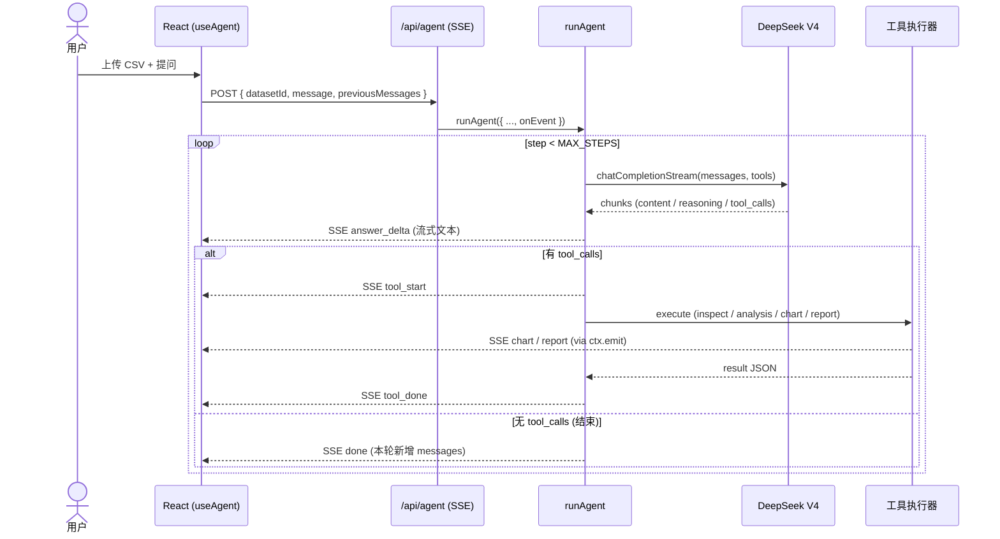

<div align="center">


# Data Analysis Agent

**用自然语言分析数据 —— 一个生产级 LLM Agent 项目**

上传 CSV / Excel，用大白话提问，看 AI Agent 实时拆解、计算、出图、写结论。

[](https://nextjs.org)
[](https://typescriptlang.org)
[](https://platform.deepseek.com)
[](https://data-analysis-agent-omega.vercel.app)

[🌐 **Live Demo**](https://data-analysis-agent-omega.vercel.app) · [📖 学习笔记](./LEARNING.md) · [📊 进度看板](./PROGRESS.md)

</div>

---

## 项目定位

让 **不会写 SQL / Python 的业务用户** 也能做数据分析。

把 Excel 丢进去，用自然语言提问，Agent 自主决定每一步要调用什么工具（看数据 → 计算 → 出图 → 给结论），**全过程实时流式展示**，让用户能看到 AI 的每一个动作。

### 一次完整交互

```
用户:    哪个区域销售额最高？

Agent:   [Database]    正在读取数据结构...         ✓
         [Calculator]  正在按区域汇总销售额...    ✓
         [BarChart]    正在生成图表...            ✓

         华东区域销售额最高，达 **44,700** 元，
         比第二名华北（31,500）高出 42%。

         [📊 柱状图已渲染]
         [📄 下载 .html 报告]
```

每一步可见、每一个数字可追溯。导出的 HTML 报告**离线可双击打开**，内嵌图表 SVG，普通用户友好。

---

## 演示

> 截图占位 — 添加 2~3 张：上传界面 / Agent 流式步骤 / 图表 + 报告下载
>
> 建议录一段 30s GIF 放这里（Loom / CleanShot 都可）

<!--


-->

---

## 核心特性

- 🤖 **多步 Agent 推理** — 自动调用 `inspect_data` → `run_analysis` → `create_chart` → `generate_report`
- 🌊 **全程流式** — 文字 / 工具步骤 / 图表 / 报告通过 SSE 实时推送
- 🧠 **支持 DeepSeek V4 thinking mode** — `reasoning_content` 字段按协议回 echo
- 📊 **4 种图表类型** — bar / line / pie / scatter，基于 Recharts，主题色自动跟随
- 📄 **HTML 报告导出** — 内嵌 SVG 图表，离线可双击打开，无外部依赖
- 🌗 **明 / 暗主题** — 14 个语义化 CSS 变量，组件零硬编码颜色
- 🔄 **每个数据集独立历史** — 切换数据集互不污染对话上下文
- 🌐 **Provider 抽象** — DeepSeek / OpenAI / Claude 通过环境变量切换
- 🛡️ **沙箱执行** — LLM 生成的 JS 在 `node:vm` 内跑，globals 白名单 + 5s 超时
- ✂️ **Token 控制** — 工具结果自动截断，长对话不爆上下文

---

## 技术栈

| 层 | 选型 | 理由 |
|---|---|---|
| 框架 | **Next.js 16** (App Router, Turbopack) | 全栈一体，API Route 不用单独搭后端 |
| 语言 | **TypeScript strict** | 类型在 SSE / tool / LLM 协议间流转，必须 strict |
| LLM | **DeepSeek V4** (OpenAI 兼容) | 中文好、价格低、支持 Tool Use 与 thinking mode |
| 流式 | **原生 SSE + ReadableStream** | 单向流足够；WebSocket 是双向通信，本场景过度设计 |
| 图表 | **Recharts** | React 原生 + SVG 输出（可抓取嵌入报告） |
| 样式 | **Tailwind v4** + CSS variables | `@theme inline` 让 token 体系天然落地 |
| 主题 | next-themes | SSR 安全、不闪 |
| Markdown | react-markdown + remark-gfm | 14 个元素 custom map，贴合对话紧凑场景 |
| 解析 | papaparse + xlsx | 服务端解析，含列类型推断 |
| 沙箱 | `node:vm` (Phase 1) → E2B (规划) | globals 白名单 + 5s timeout |
| 报告 | marked + inline CSS | 离线可读 + 内嵌 SVG 图表 |

---

## 架构核心

Agent 主循环是整个项目的心脏（[`lib/agent.ts`](./lib/agent.ts)，约 250 行）：



完整数据形态变换 + 真实 JSON 示例见 [`LEARNING.md § 2.4`](./LEARNING.md)。

---

## 快速开始

### 环境要求

- **Node.js 20+**（生产环境跑 24.x）
- **DeepSeek API Key** — [platform.deepseek.com](https://platform.deepseek.com) 注册有免费额度

### 本地启动

```bash
git clone https://github.com/vaezc/data-analysis-agent.git
cd data-analysis-agent
npm install
cp .env.local.example .env.local
# 编辑 .env.local，把 LLM_API_KEY 填上 sk-xxx
npm run dev
```

浏览器打开 http://localhost:3000

### 试一下

1. 上传 `scripts/sample.csv`（项目自带的小销售数据）
2. 输入 "**哪个区域销售额最高？**"
3. 看 Agent 一步步推理

### 部署到 Vercel

```bash
# 1. push 到自己的 GitHub 仓库
# 2. Vercel 导入项目
# 3. 添加 5 个环境变量（Production scope）：
#    LLM_PROVIDER                = deepseek
#    LLM_API_KEY                 = sk-xxx
#    LLM_MODEL                   = deepseek-v4-flash
#    SUPABASE_URL                = https://xxx.supabase.co
#    SUPABASE_SERVICE_ROLE_KEY   = sb_secret_xxx
# 4. 在 Supabase 控制台跑建表 SQL（datasets + messages，见 lib/messages-store.ts）
# 5. Deploy
```

---

## 项目结构

```
data-analysis-agent/
├── app/
│   ├── api/
│   │   ├── agent/route.ts          # SSE Agent 端点
│   │   └── upload/route.ts         # 文件上传 + 解析
│   ├── page.tsx                    # 主对话界面
│   └── globals.css                 # 14 个语义 CSS token
├── lib/
│   ├── agent.ts                    # ★ Agent 主循环
│   ├── llm.ts                      # Provider 抽象
│   ├── dataset-store.ts            # 数据集存储（内存版，Supabase 规划中）
│   └── tools/
│       ├── definitions.ts          # 工具 schema（给 LLM 看）
│       └── executor.ts             # 工具执行 + 截断
├── hooks/
│   └── use-agent.ts                # SSE 消费 + per-dataset 历史
├── components/chat/
│   ├── ChatPanel.tsx
│   ├── MessageBubble.tsx
│   ├── ChartRenderer.tsx
│   ├── ReportCard.tsx              # HTML 导出 + 内嵌 SVG
│   └── StepList.tsx
└── types/index.ts                  # 全局类型（StreamEvent / ChatMessage）
```

---

## 推荐阅读路径

| 想了解什么 | 看哪里 |
|---|---|
| **Agent 主循环 + 三种 delta 累积** | [`lib/agent.ts`](./lib/agent.ts) · [LEARNING.md § 3.1](./LEARNING.md) |
| **SSE 流式协议 + UTF-8 安全** | [`hooks/use-agent.ts`](./hooks/use-agent.ts) · [LEARNING.md § 3.2](./LEARNING.md) |
| **Tool result 截断（控 token）** | [`lib/tools/executor.ts`](./lib/tools/executor.ts) · [LEARNING.md § 6.2](./LEARNING.md) |
| **HTML 报告内嵌 SVG 图表** | [`components/chat/ReportCard.tsx`](./components/chat/ReportCard.tsx) · [LEARNING.md § 4.3](./LEARNING.md) |
| **Sticky-to-bottom 滚动** | [`components/chat/ChatPanel.tsx`](./components/chat/ChatPanel.tsx) · [LEARNING.md § 4.2](./LEARNING.md) |
| **为什么不用 Zustand**（状态管理决策） | [LEARNING.md § 3.8](./LEARNING.md) |

---

## 文档导览

- **[`LEARNING.md`](./LEARNING.md)** — 学习笔记 + 面试备忘
  - Mermaid 时序图 / 流程图
  - 9 个核心架构决策（带"为什么"）
  - 5 个实现亮点深度展开
  - 25+ 道面试问答（按系统设计 / 性能 / 安全 / 调试 / 业务 / 编码六类）
  - 附录：一次完整请求的数据流追踪（含真实 JSON 示例）
- **[`PROGRESS.md`](./PROGRESS.md)** — 项目蓝图 + 局限登记册 + 优化项 backlog
- **[`CLAUDE.md`](./CLAUDE.md)** — 开发规范与约束

---

## Roadmap

- [x] **Phase 1** — Agent 主循环、工具系统、SSE 流式
- [x] **Phase 2** — Recharts 图表、明暗主题、流式 answer、多轮上下文
- [x] **Phase 3 (部分)** — HTML 报告导出 + SVG 内嵌
- [x] **Vercel 部署上线** — Live Demo 可用
- [x] **Supabase 持久化** — 数据集 + 对话历史（解决 Vercel Serverless 跨函数内存隔离）
- [ ] **E2B 沙箱** — 替换 `node:vm` 跑真 Python
- [ ] **滑动窗口上下文** + 前端 New Chat 按钮
- [ ] **DuckDB-WASM** — 大数据集真 SQL 分析
- [ ] **Vision 多模态** — Agent 直接分析截图中的数据

完整登记见 [`PROGRESS.md`](./PROGRESS.md)。

---

## License

MIT

---

<div align="center">

Built with [Claude Code](https://claude.com/claude-code).

</div>
